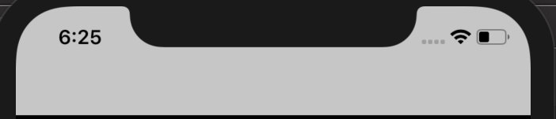
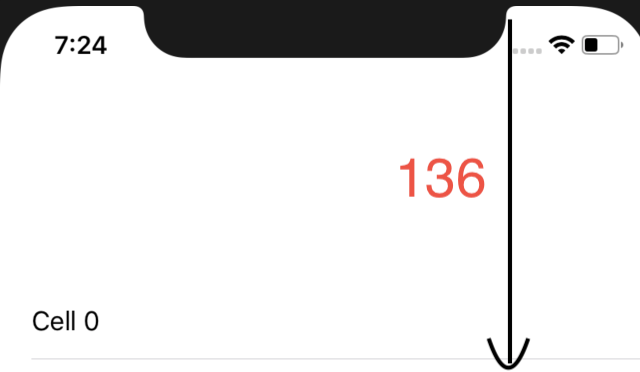

### Creating a sticky header for a UITableView without storyboard.


* This tutorial uses objective C.

Well, this is actually my first article on Medium.
I want to share my knowledge and everything i have learned and searched on internet for many people. By using this way I can improve a lot of skills, both my technical and my writing skill.
I’ve been looking for an easy solution to create sticky header which i have never seen on Medium. After a few hours of playing around with XCode I’ve come up with a great way to nail this. Here’s what it’ll look like:

* BOILERPLATE SETUP
We will hide header of UINavigationController by this code:



To start off, you need to create a ViewController that contains both a UIView and a UITableView. The UIView should be named “Header View” with a height is 132 point (#define HEADER_HEIGHT 132). Likewise, the UITableView should be laid out under HeaderView.
In this post I just want to focus on how to create a sticky header so I assume that you guys already knew UITableView. Therefore I’m just going to give you some boilerplate code with 30 cells so that we can actually scroll our content up and down.
```swift
#import "RootViewController.h"
@interface RootViewController ()  < UITableViewDataSource , UITableViewDelegate>
@property (nonatomic, strong) UITableView *tableView;
@property (nonatomic, strong) HeaderView * headerView;
@end
@implementation RootViewController
- (void)viewDidLoad {
  [super viewDidLoad];
  [self.navigationController setNavigationBarHidden:YES]; 
self.tableView.frame = CGRectMake(0, 0,  self.view.frame.size.width, self.view.frame.size.height);
self.headerView.frame = CGRectMake(0, 0,       self.view.frame.size.width, HEADER_HEIGHT); 
}
- (NSInteger)numberOfSectionsInTableView:(UITableView *)tableView {
return 1;
}
- (NSInteger)tableView:(UITableView *)tableView numberOfRowsInSection:(NSInteger)section {
return 30;
}
- (UITableViewCell *)tableView:(UITableView *)tableView   cellForRowAtIndexPath:(NSIndexPath *)indexPath {
 UITableViewCell * cell = UITableViewCell.new;
 cell.textLabel.text = [NSString stringWithFormat:@"Cell %tu", indexPath.row];
 return cell;
}
- (UITableView *)tableView {
if (!_tableView) {
 _tableView = UITableView.new;
 _tableView.backgroundColor = [UIColor whiteColor];
 _tableView.dataSource = self;
 _tableView.delegate = self;
 [self.view addSubview:_tableView];
}
return _tableView;
}
- (HeaderView *)headerView {
if (!_headerView) {
_headerView = HeaderView.new;
[self.view addSubview:_headerView];
}
return _headerView;
}
@end
```

The key of this article I wanna share with you guys is using UIEdgeInsetsMake. I set the padding-top of tableView equal 132 point.(which i did define above is HEADER_HEIGHT)
```swift
_tableView.contentInset = UIEdgeInsetsMake(HEADER_HEIGHT, 0, 0, 0);
```

The scroll view encloses the content view plus whatever padding is provided by the specified content insets. Here we set the padding-top 136 point. Therefore when we scroll the content of the tableView up, it will go through the top part of screen visibility.
Note: the current contentOffset.y now is -136.
# Setup HeaderView
We have 3 elements as subviews of headerView. That are
* topHeaderView
* botHeaderView
* hideTitleTopView

I’ll explain why we need them.
- **botHeaderView** we will use it to contain MESSAGE text under and collapse / expand the UITableView Header flow when scrolling up or down of content of tableview and it’s height is 44 point.
- **topHeaderView** is the rest of headerview, its height is 88 points.
- **hideTitleTopView** i use it to hide the top title when we haven’t scrolled the tableView. Here is code to create the headerViewheaderView

```swift
// HeaderView.h
@interface HeaderView : UIView
@property (nonatomic, strong) UIView * botHeaderView;
@property (nonatomic, strong) UIView * topHeaderView;
@property (nonatomic, strong) UIView * hideTitleTopView;
@property (nonatomic, strong) UILabel * titleBotLab;
@property (nonatomic, strong) UILabel * titleTopLab;
@end
//  HeaderView.m
#import "../define.h"
#import "HeaderView.h"
@interface HeaderView()
@end
@implementation HeaderView
- (void)layoutSubviews {
self.botHeaderView.frame = CGRectMake(0, 88, self.frame.size.width , 44);
self.topHeaderView.frame = CGRectMake(0, 0, self.frame.size.width , HEADER_HEIGHT - self.botHeaderView.frame.size.height);
self.titleBotLab.frame = CGRectMake(10, 0, self.botHeaderView.frame.size.width, self.botHeaderView.frame.size.height);
self.hideTitleTopView.frame = CGRectMake (0, 0 , self.frame.size.width, 44);
}
- (UIView *)botHeaderView {
if (!_botHeaderView) {
_botHeaderView = UIView.new;
[self addSubview:_botHeaderView];
}
return _botHeaderView;
}
- (UIView *)topHeaderView {
if (!_topHeaderView) {
  _topHeaderView = UIView.new;
  _topHeaderView.backgroundColor = [UIColor whiteColor];
 [self addSubview:_topHeaderView];
}
return _topHeaderView;
}
- (UIView *)hideTitleTopView  {
if (!_hideTitleTopView) {
_hideTitleTopView = UIView.new;
_hideTitleTopView.backgroundColor = [UIColor whiteColor];
[self addSubview:_hideTitleTopView];
}
return _hideTitleTopView;
}
- (UILabel *)titleBotLab {
if (!_titleBotLab) {
_titleBotLab = UILabel.new;
[_titleBotLab setFont:[UIFont boldSystemFontOfSize:44]];
_titleBotLab.text = @"MESSAGE";
[self.botHeaderView addSubview:_titleBotLab];
}
return  _titleBotLab;
}
- (UILabel *)titleTopLab {
  if (!_titleTopLab) {
 _titleTopLab = UILabel.new;
 [_titleTopLab setFont:[UIFont boldSystemFontOfSize:23]];
 _titleTopLab.textAlignment = NSTextAlignmentCenter;
 _titleTopLab.text = @"Message";
 [self.topHeaderView addSubview:_titleTopLab];
}
return  _titleTopLab;
}
@end
```

Now our job is to move the botHeaderView up as many points as the content of the tableView moves as we scroll it up or down.
```swift
// rootViewController.h
-(void)scrollViewDidScroll:(UIScrollView *)scrollView {
float scrollDiff = scrollView.contentOffset.y  +  HEADER_HEIGHT;
[self.headerView setHeightForBotHeader:scrollDiff];
[self.headerView setHeightForTopHeader:scrollDiff];
}
```

In file HeaderView.m we just implement 2 function to set height for botHeaderView and topHeaderView.

```swift
// HeaderView.m file
- (void) setHeightForBotHeader:(float) scrollDiff { self.botHeaderView.frame = CGRectMake(0, self.botHeaderView.frame.size.height - scrollDiff, self.frame.size.width , 44);
}
- (void) setHeightForTopHeader:(float) scrollDiff {self.titleTopLab.frame = CGRectMake(0, MIN(44, scrollDiff),  self.frame.size.width , 44);
}
```

Build and run. Thats pretty cool . We have a smooth animating header!
Click [here](https://github.com/thinh2zalo/sticky-header) to see the finished example project on github.
